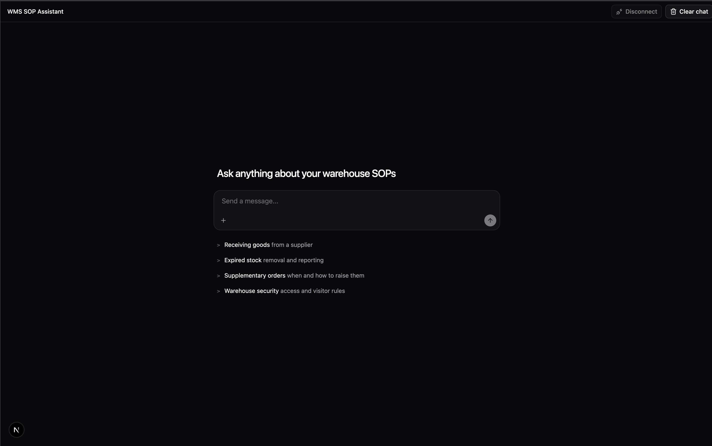
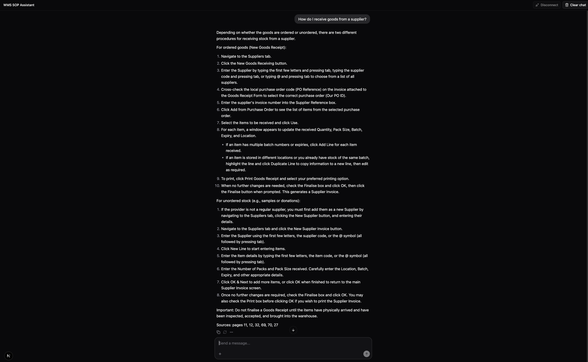

# WMS SOP Assistant

Ask questions about a warehouse Standard Operating Procedures (SOP) PDF and get
answers that are grounded in the document, with page citations. It is a RAG
pipeline with a chat UI and an [MCP](https://modelcontextprotocol.io) tool.



Ask, for example, *"How do I receive goods from a supplier?"*. The answer streams
in and ends with a `Sources: pages ...` line:



## What I used

| Part | Tool |
|---|---|
| PDF parsing | [Docling](https://github.com/docling-project/docling) with a vision-language model (VLM): `gemma4:31b-cloud` via Ollama reads each page image and returns Markdown |
| Chunking & tagging | LlamaIndex `SentenceSplitter`, `TitleExtractor`, `QuestionsAnsweredExtractor` |
| Embeddings | `embeddinggemma:300m` via Ollama (768 dimensions) |
| Vector store | Postgres + pgvector, hybrid search (vectors + full-text) |
| Answer model | `gemma4:31b-cloud` via Ollama |
| API | FastAPI WebSocket (chat UI) and FastMCP with Unkey auth (agents) |
| UI | Next.js, [assistant-ui](https://www.assistant-ui.com), dark theme |
| Evaluation | [ragas](https://github.com/explodinggradients/ragas) |

## How it works

```
PDF -> VLM reads each page -> Markdown -> one document per page
    -> chunk -> tag (title + questions) -> embed -> Postgres/pgvector

question -> hybrid search (top 5) -> LLM answers from those chunks only -> answer + pages
```

**Indexing** (`server/pipeline/`)
1. **Parse:** each page image goes to the VLM, which returns Markdown (tables, steps and screenshots included).
2. **Pages:** each page becomes one document tagged with file name, page number, module, system and doc type.
3. **Chunk:** each chunk is the page plus the first 2000 characters of the next page, split into 1200-character pieces with 200 overlap. A procedure that continues over a page break stays in one chunk.
4. **Tag:** an LLM adds a short title and 3 questions each chunk can answer. This helps when users phrase things differently from the document.
5. **Embed and store:** vectors and text go into one Postgres table, which also keeps a full-text index.

**Search:** hybrid mode combines vector similarity (meaning) with Postgres full-text search (exact words). The top chunks go to the LLM, which is told to answer only from them, cite pages, and say so when the document doesn't cover the question.

## How the UI talks to the server

The chat UI opens a WebSocket to `ws://localhost:8000/ws/stream` for each question.

```
browser                                   server
  | -- {"query": "How do I ...?"} ------>  |  search + generate
  | <-- {"type": "token", "content": ..} - |  repeated, as the model writes
  | <-- {"type": "done"} ----------------  |  (or {"type": "error", "content": ...})
```

- **Disconnect** closes the socket. The server notices straight away and cancels the search and generation.
- **Clear chat** disconnects and deletes the conversation from the page.
- Agents use the same search through the MCP tool `sop_query_tool`, which returns `{answer, citations, confidence}` and requires an `Authorization: Bearer <key>` header.

## Run it

```bash
# 1. Postgres with pgvector
docker run -d --name pgvector-db -p 5432:5432 -e POSTGRES_USER=postgres \
  -e POSTGRES_PASSWORD=postgres -e POSTGRES_DB=mydb pgvector/pgvector:pg16

# 2. Models (Ollama must be running; sign in for the :cloud model)
ollama pull embeddinggemma:300m

# 3. Index a PDF (parse -> chunk -> embed -> store)
cd server && python -m pipeline.main "data/<your-sop>.pdf"

# 4. Chat API (port 8000)
uvicorn api.main:app --port 8000

# 5. UI (http://localhost:3000)
cd ../frontend/sop-chatbot && npm install && npm run dev
```

The MCP server for agents starts with `wms-sop-mcp start` (port 8001). Settings are
read from `.env`; see `server/config/settings.py` for all of them (`PG_*`,
`OLLAMA_*`, `UNKEY_ROOT_API_KEY`, `OPENAI_API_KEY`).

## Evaluation

`server/evaluation/` scores retrieval and generation separately with ragas
(`gpt-4.1-mini` as the judge), so a low score points at the right stage.

```bash
cd server && python -m evaluation.report     # writes eval_report.html
```

| Check | Questions | Result |
|---|---|---|
| Retrieval: context precision | 12 | 0.88 average |
| Retrieval: context recall | 12 | 1.00 average |
| Generation: faithfulness | 10 | 0.97 average |
| Generation: answer relevancy | 10 | 0.66 average (0.74 without the trap question) |

- Retrieval questions are phrased away from the document's own words, so keyword
  matching alone can't win.
- Generation is tested on a fixed context. One question is a trap whose answer
  is not in the context. The model correctly says so, which scores 0 on relevancy
  by design.
- These numbers come from an earlier run (August), before the VLM parsing and
  Ollama embeddings. Re-run the report to refresh them.

## Design decisions

- **A vision model reads each page, not plain OCR.** SOPs are full of screenshots,
  tables and flowcharts. Page images go to a VLM that returns clean Markdown, so
  steps, tables and button names survive.
- **Chunks run across page breaks.** A procedure that continues on the next page
  stays in one chunk, so step-by-step answers aren't cut in half.
- **Every chunk is tagged with a title and the questions it answers.** Users don't
  phrase things like the document does. The retrieval eval uses deliberately
  reworded questions and scores 1.00 recall.
- **Hybrid search.** Vector similarity finds the meaning; full-text search catches
  exact terms like screen names and codes. Either one alone misses cases.
- **Answers are grounded or refused.** The model answers only from retrieved text,
  cites pages, and says so when the document doesn't cover a question. A
  built-in trap question in the eval checks this.
- **Retrieval and generation are evaluated separately.** A bad score points to the
  stage that caused it instead of blurring the two.
- **Streaming that can be cancelled.** Answers stream token by token. If the user
  hits Disconnect, the server cancels the search and the model call immediately,
  so no compute is wasted on an answer nobody is reading.
- **One pipeline entry point.** `python -m pipeline.main file.pdf` parses, chunks,
  tags, embeds and stores a document in one command.

## Next steps

- Skip documents that are already indexed, so re-running a PDF doesn't duplicate chunks.
- Add integration tests against a live Postgres instance.
